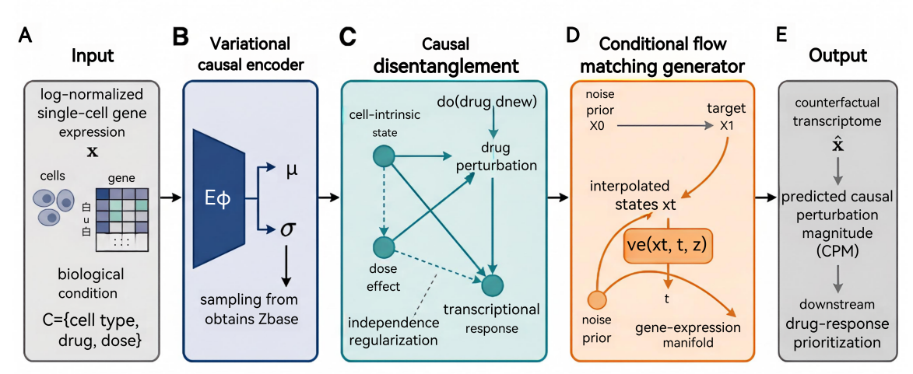
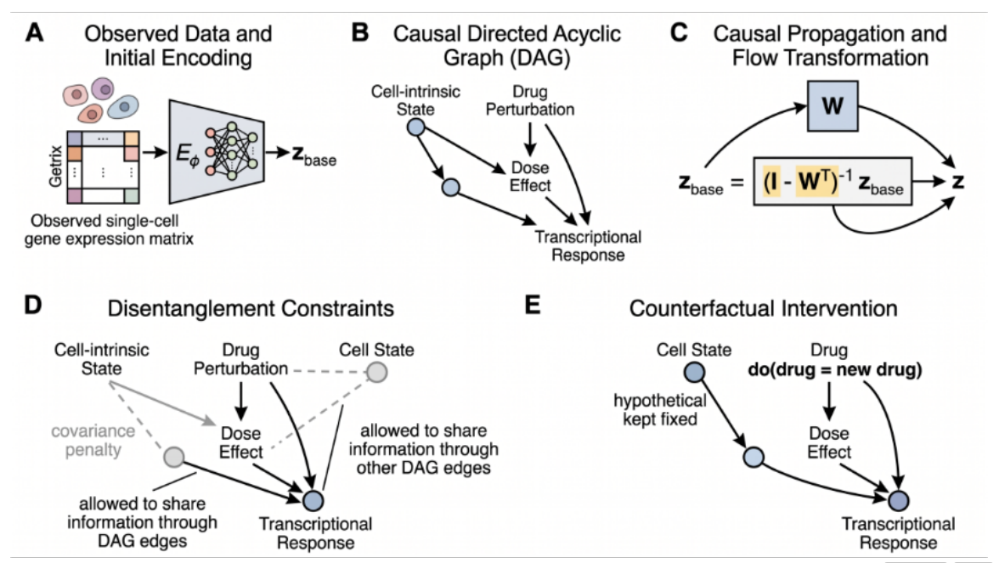
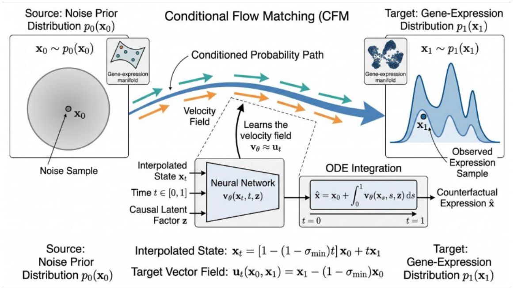

# CausFlow

## Causal Disentanglement and Conditional Flow Matching for Single-Cell Drug Perturbation Prediction

---

## Introduction

Single-cell perturbation prediction aims to infer transcriptomic responses under unseen drug, dose, and cellular conditions. Existing approaches often struggle under distribution shift because drug effects, cellular identity, dose, and technical variation are entangled within observed gene expression.

**CausFlow** addresses this problem through a unified causal generative framework combining:

* **Structural Causal Modeling (SCM)** for disentangled, intervention-stable latent representation learning.
* **Conditional Flow Matching (CFM)** for continuous counterfactual transcriptome generation.
* **Causal Perturbation Magnitude (CPM)** for phenotype-oriented drug response prioritization.

The model supports both **in-distribution (ID)** and **out-of-distribution (OOD)** perturbation prediction across multiple single-cell benchmarks and downstream colorectal cancer drug-response validation.

---

## Overview

### Framework Overview

### Causal Disentanglement Module

### Conditional Flow Matching Generation

---

## Data Availability

All datasets used in this study are publicly available in https://drive.google.com/drive/folders/1kBnC7z5DrFzdgGEGcC4HVMjZIxH72LgU?usp=drive_link.
